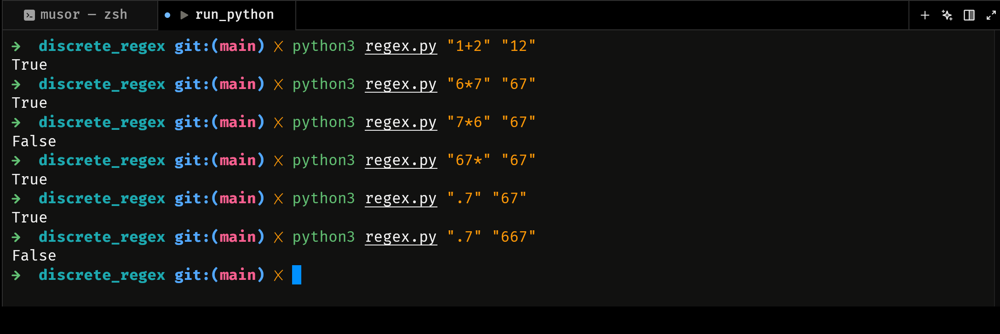

# Реалізація регулярних виразів через скінченні автомати
## Звіт роботи

Під час роботи над проєктом було виконано такі кроки:
1. Заповнено всі порожні методи, позначені коментарем `# Implement`. Створено повноцінну логіку для `TerminationState`, `DotState`, `AsciiState`, `StarState` та `PlusState`.

2. Реалізовано метод `check_string` за допомогою пошуку в глибину (DFS), який проходить по графу станів та перевіряє вхідний рядок.

3. Та загалом реалізовано все що треба для запуску.

## Коротке пояснення імплементації

Програма моделює роботу Недетермінованого Скінченного Автомата. 

* **Стани (States):** Кожен елемент регулярного виразу (конкретний символ, крапка, квантифікатор) представляється окремим об'єктом, що наслідує базовий клас `State`. Кожен стан має посилання на наступні можливі стани (`self.next_states`).
* **Квантифікатори (`*`, `+`):** Вони реалізовані як стани-обгортки. Вони зберігають у собі попередній стан (`checking_state`) і керують логікою повторень. Наприклад, `StarState` дозволяє як спробувати знайти збіг із внутрішнім станом (і зациклитись), так і повністю пропустити його і перейти до наступного етапу.
* **Побудова автомата (`RegexFSM`):** Клас приймає рядок-шаблон (наприклад, `a*4.+hi`), посимвольно розбирає його і зшиває стани між собою.
* **Перевірка (DFS):** Коли ми викликаємо `check_string("рядок")`, алгоритм рекурсивно намагається знайти такий шлях в графі станів (починаючи з `StartState`), щоб усі символи збіглися, і останній перехід привів би до `TerminationState`. Якщо такий шлях існує — повертається `True`, інакше — `False`.

## Інструкції до запуску

1. Відкрийте термінал у папці з файлом `regex.py`.
2. Виконайте команду:
   ```bash
   python3 regex.py "pattern" "input"
   ```
3. Ви побачите результат перевірки:
   ```text
   False або True
   ```

Приклад:

